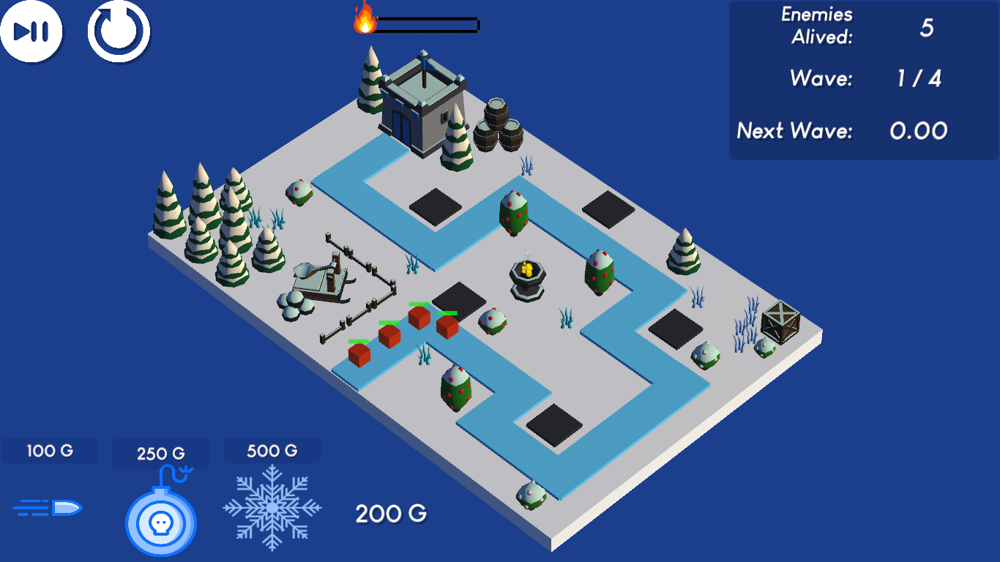

# Tower Defense Ice vs. Fire (Unity C#)

<h1 align="center">
  
</h1>

- Trabalho avaliativo para o minicurso de Unity Básico.
- Curso de Ciências da Computação na Universidade Federal de Jataí.
- <b>Ano de aplicação:</b> 2020.

## Descrição
Desenvolvimento dos elementos e mecânicas básicas de um subgênero do jogo de estratégia Tower Defense. Dentre as tarefas desenvolvidas:
- Construção da interface gráfica (ex.: botões, HUD, mensagens).
- Personagens/ entidades (ex.: estruturas, inimigos).
- Posicionamento de torres; mecânicas de ataque e movimentação das torres de acordo com a posição dos inimigos.
- Sistema de gerenciamento da compra e venda de torres.
